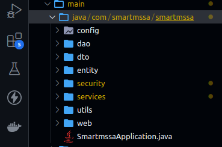
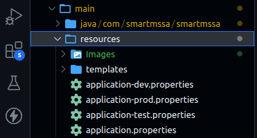
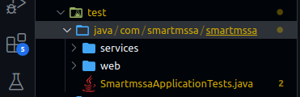

# Documentation pour les développeurs

# Canal de discussion : 

## Introduction

###### Une template structurée d'ensemble pour les projets Java est un modèle de base préconçu qui offre une architecture organisée et cohérente pour le développement de logiciels Java. Le but principal d'une telle template est de fournir une base solide et uniforme pour la création de projets, en facilitant la mise en place de bonnes pratiques de développement et en réduisant le temps passé sur la configuration initiale. Voici quelques-uns des objectifs clés d'une template structurée pour les projets Java :

###### 1. Uniformité : Une template structurée garantit que tous les projets Java au sein d'une organisation ou d'une équipe suivent une structure et des conventions de nommage cohérentes. Cela facilite la compréhension du code et la collaboration entre les membres de l'équipe.

###### 2. Productivité : En fournissant une base prête à l'emploi, une template permet aux développeurs de se concentrer sur la logique métier plutôt que de passer du temps à configurer l'infrastructure de base du projet. Cela accélère le développement.

###### 3. Maintenabilité : Une structure bien organisée encourage l'adoption de bonnes pratiques de développement telles que la séparation des préoccupations (Separation of Concerns) et la modélisation logicielle propre. Cela facilite la maintenance à long terme du code.

###### 4. Extensibilité : Une template structurée offre une base extensible où de nouveaux modules, fonctionnalités et composants peuvent être ajoutés de manière cohérente et sans perturber le code existant.

###### 5. Testabilité : Elle favorise l'écriture de tests unitaires et d'intégration en proposant une structure qui sépare clairement la logique métier de la logique d'infrastructure, ce qui rend le code plus facile à tester.

###### 6. Gestion de la Configuration : Elle peut inclure des fichiers de configuration prédéfinis pour des outils tels que Maven ou Gradle, facilitant ainsi la gestion des dépendances, des tâches de construction et des déploiements.

###### 7. Sécurité : En incluant des pratiques de sécurité recommandées dès le départ, une template structurée contribue à la création de logiciels plus sécurisés en minimisant les vulnérabilités courantes.

###### 8. Documentation : Elle peut contenir une structure de documentation préconfigurée, encourageant ainsi la création de documentation complète et cohérente pour le projet.

###### 9. Conformité aux Normes : Elle peut être conçue pour respecter les normes ou les directives spécifiques de l'organisation, ce qui est essentiel dans certaines industries réglementées.

###### 10. Adaptabilité : Une bonne template doit être suffisamment flexible pour s'adapter aux besoins spécifiques de chaque projet tout en maintenant une structure de base cohérente.

## Structure de template 

#### Une fois que vous entrez dans le projet, dans le répertoire "`main/java/com/smasrtmssa/smartmssa`", vous devriez trouver 8 répertoires et une classe appelée SmartmssaApplication qui est le point d'entrée de notre application :

###### Le premier répertoire (config): Cest un repertoire au'ont peut stockez des fichiers de configuration externes pour vonotre application. L'objectif principal de créer un répertoire de configuration est de séparer les paramètres de configuration de votre application de son code source. Cela offre plusieurs avantages (Flexibilité, Sécurité, Gestion des environnements, Meilleure maintenance, ...etc).

###### Un deuxième répertoire nommé dao (Repository): La création d'un répertoire (ou repository) a pour objectif de gérer la persistance des données. Plus précisément, cela implique généralement la gestion des opérations de lecture (consultation), d'écriture (ajout/mise à jour) et de suppression des données dans une base de données ou un système de stockage.
###### Les principales raisons de créer un repository dans un projet Spring Boot sont les suivantes(Abstraction des opérations de base de données, Facilité d'utilisation, Gestion des entités, Intégration avec Spring Data JPA).

###### Un troisième répertoire (Entité):La création d'une couche d'entités (Entity Layer) dans un projet Spring Boot a pour objectif de représenter les données métier de l'application sous forme d'objets Java, généralement des classes POJO (Plain Old Java Objects), qui correspondent aux entités de votre domaine. 

###### Un quatrième répertoire nommé (Sécurité): La création d'un répertoire de sécurité dans un projet Spring Boot vise généralement à mettre en place des mécanismes de sécurité pour protéger l'application. Cela peut inclure l'authentification des utilisateurs, l'autorisation des accès aux ressources, la gestion des sessions, etc. En bref, l'objectif principal est de sécuriser l'application en définissant des règles et des configurations de sécurité pour contrôler qui peut accéder à quoi, et comment ces accès sont gérés. Cela contribue à garantir que seules les personnes autorisées peuvent utiliser l'application et à protéger les données sensibles.

###### Un 5ème répertoire nommé(Services) : 
###### L'objectif de la création d'un répertoire de services dans un projet Spring Boot est de structurer et de centraliser la logique métier de votre application. Il s'agit d'une pratique courante dans l'architecture logicielle basée sur Spring, notamment dans le cadre de la conception de microservices. Voici des examples brève des objectifs(Modularité, Réutilisation, Séparation des responsabilités, Tests unitaires, Facilité de déploiement).

###### Un autre répertoire appelle (DTO): les DTOs dans un projet Spring Boot sont des objets qui permettent de structurer et de simplifier le transfert de données entre les différentes parties de votre application, en améliorant les performances, la sécurité et la maintenabilité de votre code.

###### Un autre répertoire appelle (Utils) : L'objectif de la création de ce répertoire est de regrouper tous nos endpoints dans un seul fichier (Class) déclaré comme final et si besoin nous l'appelons, cela rend le code lisible et évite de changer d'URL en cas de problème d'interception des données.

###### Et un dernier répertoire nommé(Web) : a création d'un répertoire (Web || Controller) a pour objectif de regrouper les classes qui agissent en tant que contrôleurs pour votre application. Les contrôleurs sont responsables de la gestion des requêtes HTTP entrantes, de l'exécution de la logique métier appropriée et de la renvoi des réponses HTTP aux clients.
###### Les objectifs principaux de la création de ce répertoire sont (Regrouper la logique de gestion des requêtes , Favoriser la séparation des préoccupations, Faciliter la configuration et la gestion des routes).

#### Dans le repertoire (`~/src/main`) vous devriez trouver un autre repertoire nomme (resources): la création d'un répertoire "resources" a pour objectif de stocker des ressources non Java, telles que des fichiers de configuration, des fichiers statiques (comme des images, des fichiers CSS, des fichiers JavaScript, des templates) et d'autres fichiers nécessaires à l'application, mais qui ne font pas partie du code source Java.

#### L'utilisation du répertoire "resources" dans un projet Spring Boot facilite la gestion des ressources externes et permet à votre application d'accéder à ces ressources de manière plus efficace.
#### Ce répertoire "ressources" est souvent utilisé pour une configuration externe comme la connexion au serveur SGDB (Postgresql, mysql...etc) ou avec un serveur de sécurité (Keycloak), ou un serveur SMTP...etc.
#### Dans ce répertoire nous avons créé trois profils un pour l'environnement de développement (dev), un pour l'environnement de test (test) et le dernier pour l'environnement de production (prod).

#### Dans le répertoire (`~/src/test`) : L'objectif de la création d'un répertoire de tests dans un projet Spring Boot est de permettre la mise en place de tests automatisés pour vérifier le bon fonctionnement de votre application. Les tests jouent un rôle essentiel dans le développement logiciel car ils permettent de s'assurer que votre application fonctionne correctement, même après des modifications ultérieures.
### Dans ce répertoire, vous devriez trouver deux répertoires service (pour les tests de services) et web (pour les tests des contrôleurs).

## Packages: 
###### Nous essayons de vous fournir des packages puis vous pouvez l'utiliser pour cela nous mettons un répertoire appelé "packages" => (`main/java/com/smasrtmssa/smartmssaservices`), dans ce package vous devez trouver tous les packages disponibles que vous pouvez utiliser (Nous ferons de notre mieux pour vous proposer les packages nécessaires).
###### Pour le moment, il existe deux packages, l'un pour S3 (AWS) et l'autre pour Jasper (ExportFile, PDF, HTML), vous pouvez l'utiliser librement.

## Deployment (CI/CD): (DevOps)
###### Nous essayons de créer les fichiers nécessaires pour déployer un projet spring-boot. Vous pouvez retrouver ces fichiers à la racine de chaque projet (`DockerFile`, `bitbucket-pipelines.yml` et le répertoire `argocd`).

